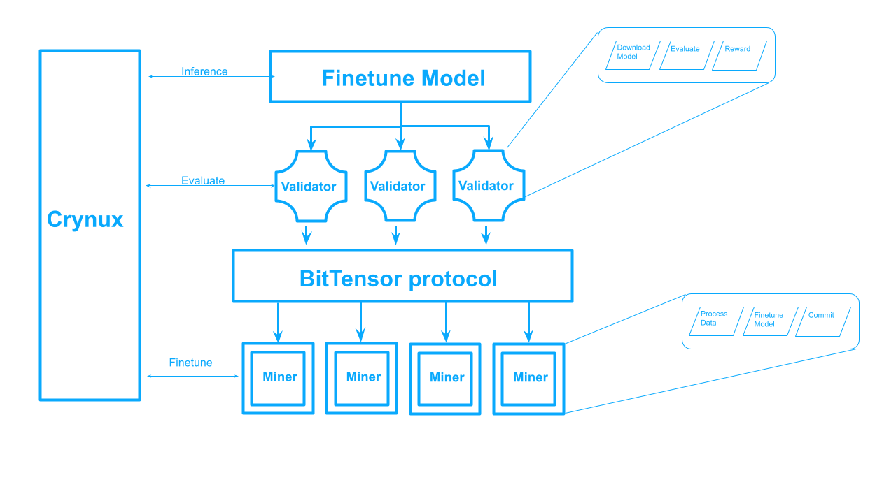

# **Genki-Dama (元気玉)**
## Federated Learning subnet on BitTensor, powered by Crynux  <!-- omit in toc -->
)
 

## Introduction

Genki-Dama, inspired by the iconic Dragon Ball technique, is the first open-source machine learning framework that utilizes decentralized data and harnesses decentralized computing resources. Built upon the incentive mechanism of BitTensor, and the computing network of Crynux, Genki-Dama empowers federated learning in a decentralized manner, shattering the limitation of centralized approaches.

It includes two parts:
* Genki: machine-learning SDK to utilize BitTensor incentive mechanism and Crynux decentralized computing resources
* Dama: open-sourced model checkpoints trained by Genki

## Federated Learning

[Federated learning](https://en.wikipedia.org/wiki/Federated_learning) is a machine learning approach designed to harness decentralized data and computing while safeguarding privacy. Its workflow can be summarized as follows:

1. Miners locally prepare data, train models, and upload weights to a central server.
2. The server aggregates gradients from miners and initiates a new round as needed.

Federated learning has been widely used in [Gboard](https://research.google/blog/federated-learning-collaborative-machine-learning-without-centralized-training-data/), [speech models](https://support.google.com/assistant/answer/11140942) without using centralized training data.

Presently, Large Language Models (LLMs) alignment demands significant [human effort](https://openai.com/index/instruction-following/) to ensure data quality. BitTensor offers a superior incentive mechanism for this process. By employing federated learning on the BitTensor subnet, miners are incentivized to contribute high-quality instruction datasets, which are invaluable assets for both OpenAI and Google, neither of whom has disclosed these datasets to date.

Furthermore, as LLM pretraining exhausts public accessible data reservoirs, federated learning emerges as a viable solution to tap into additional high-quality data for both pretraining and fine-tuning purposes.

## Miner

Utilizing Crynux decentralized computing layer, miners engage with validators by finetuning on a base model with a customized datasets. The process involves the following steps:

1. Data preparation: provide a high-quality dataset for a particular finetune task.
2. Finetune: train the model with customized datasets.
3. Commit: public the model to huggingface

## Validator

Validators are responsible for evaluating the performance from each miners, and set weights to each miner.

Although it is difficult to evaluate data quality directly, validators can evaluate the performance of finetuned model, and set weights considering these factors:
* Model quality: model will be evaluated by cross-validation with other datasets.
* Data similarity: validators set higher weights to data with less similarity to encourage miners provide diversified data.

Validators order miners by their commit timestamp, and weight them with the score: (0.95 - data_similarity) * ∆loss 

